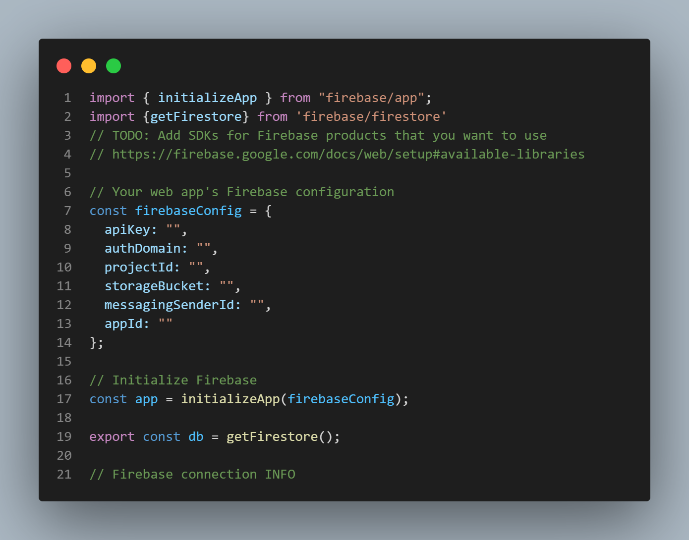

# Building the ticket app
If you want to have a go at building this for yourself there is a missing firebase.js component. 
This is something that you will need to create for yourself, I have included a code snap of what the file should look like,
minus the config files which are private to the individual firestore database. 

To get started with this you can sign up for a free account at 
## https://firebase.google.com/

This project was bootstrapped with [Create React App](https://github.com/facebook/create-react-app).

